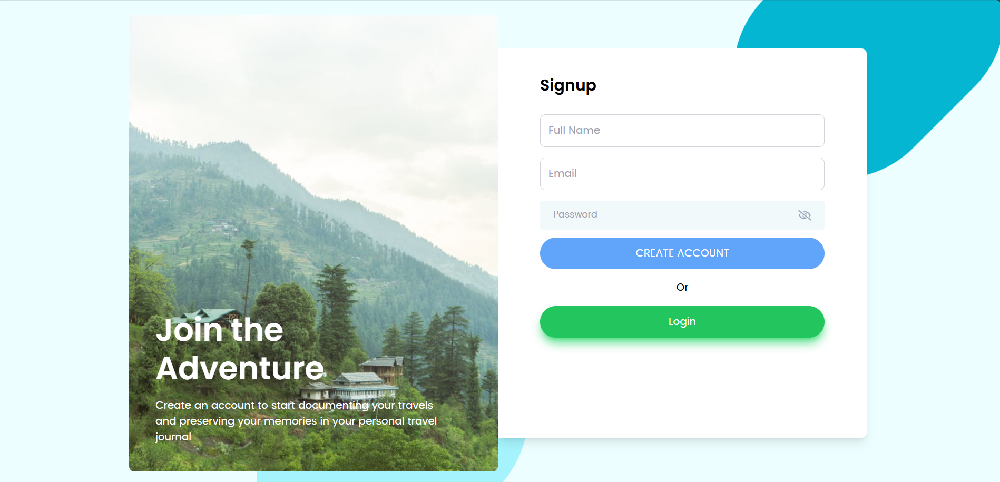
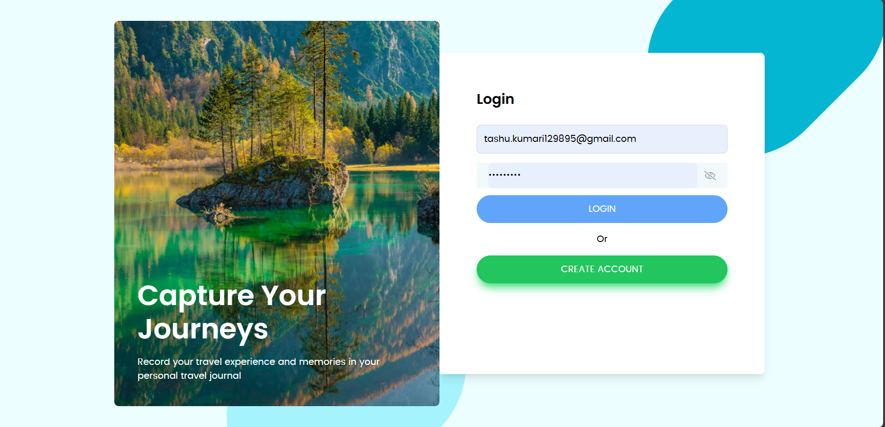
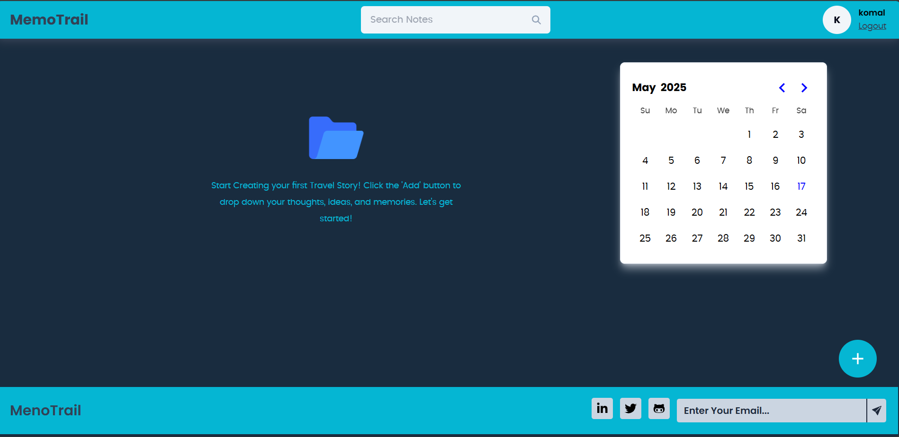
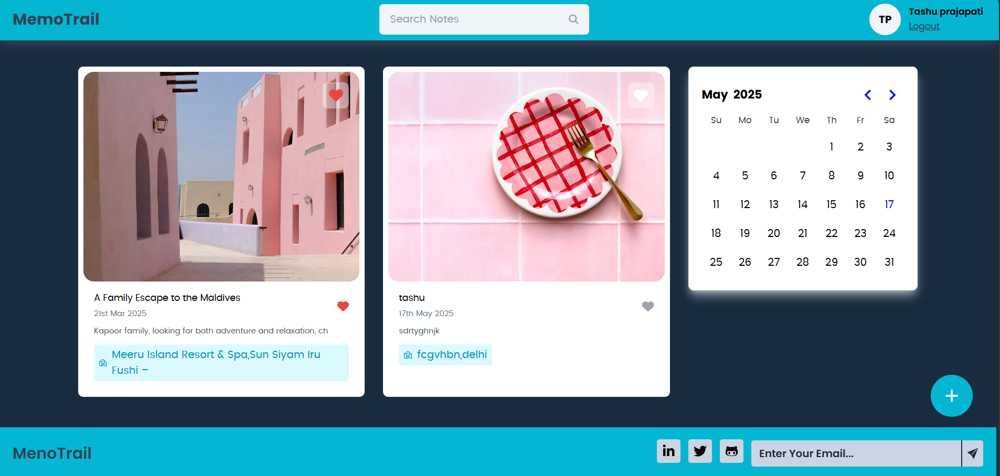
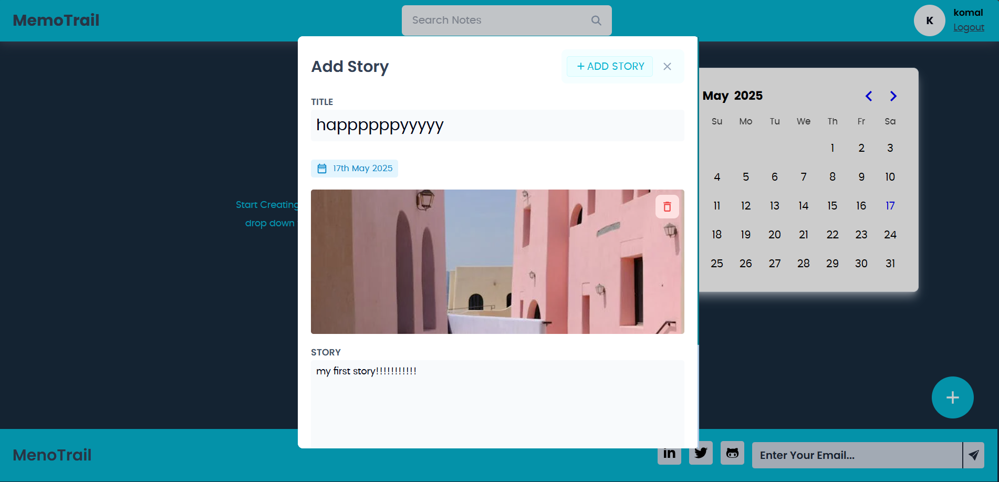
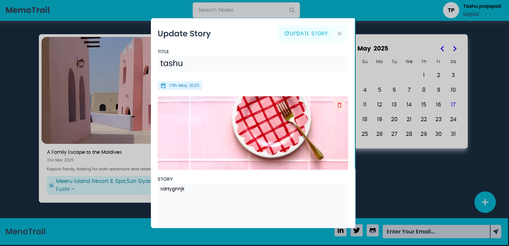
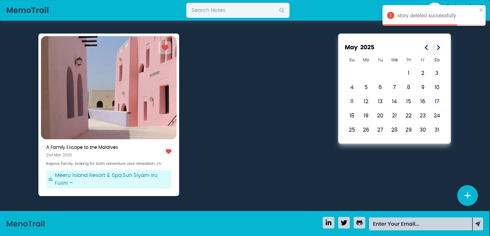
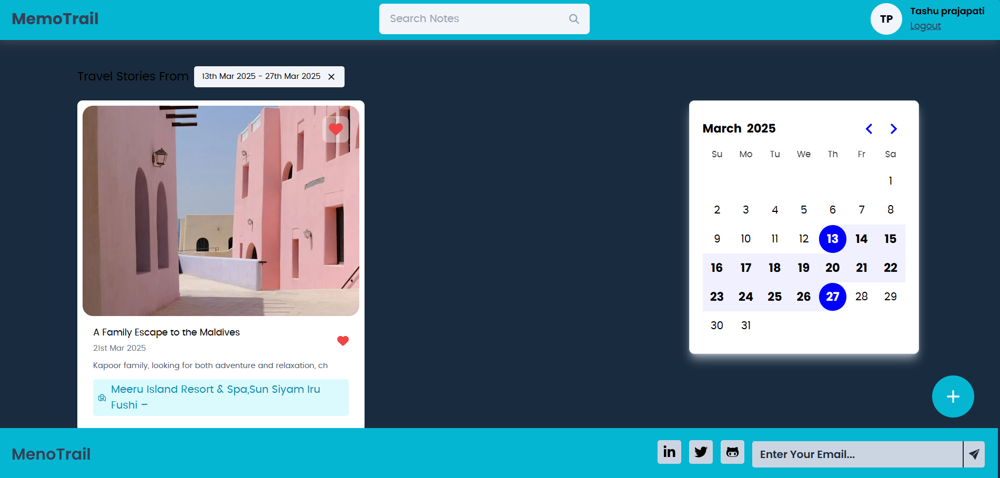
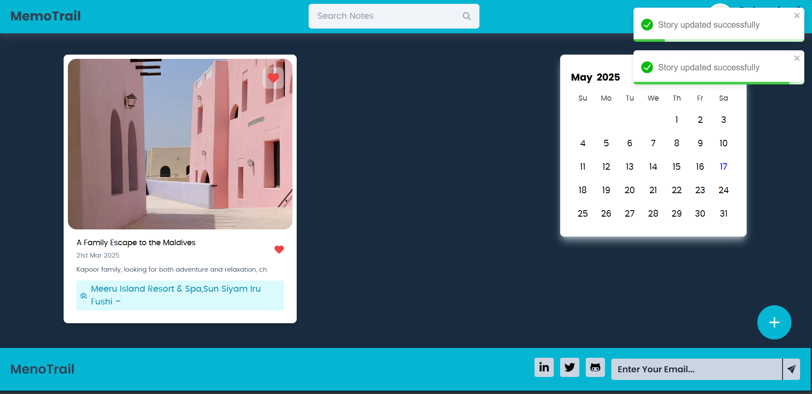

# 🌍 Travel Story App

The **Travel Story App** is a full-stack web application that enables users to **capture, manage, and share their travel experiences** with others. Users can write detailed stories including **locations, images, dates**, and **descriptions** of their journeys. It's a digital diary for travel lovers, designed with a clean UI and secure login system.

---

## 📖 Overview

Traveling is all about creating memories — this app helps users preserve those memories in a visual and interactive format. Once logged in, users can create travel stories, upload photos, and record details about their trips, such as **where they went**, **when they visited**, and **what they experienced**. 

The application follows modern web development practices and features a mobile-friendly interface. It is built using the **MERN stack** (MongoDB, Express, React, Node.js) and supports **JWT-based authentication** to protect user data.

---

## 🚀 Live Demo

- **Frontend (React + Vercel)**: [Open Frontend](https://your-frontend-url.vercel.app)
- **Backend (Express + MongoDB + Render)**: [Open Backend](https://your-backend-url.onrender.com)

> ⚠️ You must be logged in to create, edit, or delete a story.

---

## 🎯 Features

- 🔐 **User Authentication**  
  Secure login and signup using **JWT tokens**. Access control for protected routes.

- 📝 **Story Management**  
  Users can **add**, **view**, **edit**, and **delete** their travel stories.

- 📍 **Detailed Story Fields**  
  Each story includes:
  - Title
  - Description
  - Location
  - Travel/Visited Date
  - Photo (via URL or default image)

- 📤 **Image Upload Support**  
  Users can provide a valid image URL. If none is given, a placeholder is used.

- 📆 **Date Handling**  
  Travel date input is formatted into a readable format for better UX.

- 💻 **Responsive UI**  
  Mobile-friendly layout with clean visuals and modern CSS.

---

## 🧱 Tech Stack

### 🔹 Frontend
- React.js
- React Router DOM
- Axios
- Tailwind CSS (or your preferred CSS framework)
- JWT-based auth
- Hosted on **Vercel**

### 🔹 Backend
- Node.js
- Express.js
- MongoDB with Mongoose
- JWT Authentication
- CORS, Helmet for security
- Hosted on **Render**

---

## website Features :

